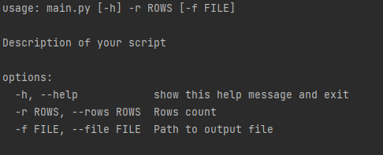
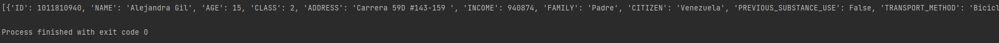
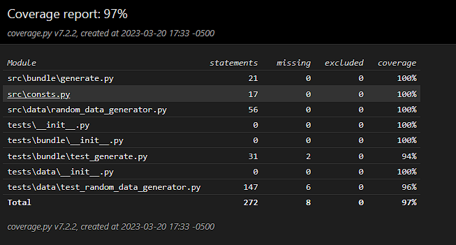

# IDIPRON data generation
Data generation for the IDIPRON institute (Instituto Distrital para la Protección de la Niñez y la Juventud - Colombia).

## Description

Includes the random data generation for a variable number of rows. These rows include information for young people in idipron.

The list of data generated is:

* Identification number
* Name
* Social status (class)
* Address
* Family income
* Citizenship
* Previous use of substances
* Transport method to the IDIPRON unit
* Neighbor
* If the person has lived in the streets
* If the person is working
* Study level
* Main hobby
* Number of children

## Getting Started

### Dependencies

* Python 3.10.2
* Command line

### Program execution (Windows 10)

* Open the console in the project root
* If you are going to create a local environment follow the next instructions
  * Run ```python -m venv myenv```
  * Run ```.\myenv\Scripts\activate```
* To run tests ```python -m unittest discover```

### Usage

Help command:
* ```python main.py --help```

Output:



Generate 100 rows:
* ```python main.py --rows 100```



### CSV file generation

This program supports the csv generation of the data.

Run the --file option to do:

* ```python main.py --rows 100 --file ./data```


### Coverage report



To replicate the coverage report, run:
* Run the tests with coverage ```python -m coverage run -m unittest discover```
* Generate the HTML report ```python -m coverage html```
* Open the report [file](htmlcov/index.html)

## Authors

Contributor names and contact info

- [alejovasquero](https://github.com/alejovasquero)

## Version History

* 1.0
    * Initial version

## License

This project is licensed under the GPL GNU License - see the [LICENSE.md](/LICENSE) file for details

## Acknowledgments

* To the work being done in IDIPRON (https://www.idipron.gov.co/) 
* This information is random, and does not reflect a real person sensitive data